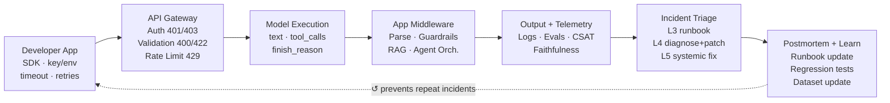

# [cesarAIshepherd](https://su0xpj-bastion.github.io/cesarAIshepherd-pages)

## 1. Intro

Interactive React dashboard simulating the L3 → L4 → L5 support engineering
lifecycle for real-world OpenAI API incidents.

Core components:
- `src/App.jsx`: root shell — header, scenario selector, SLA metrics strip, pipeline sidebar, tab router.
- `src/data.js`: all scenario data — steps, timeline, PIR, fix, severity, affectedNodes, customerReply.
- `src/components/MasterDiagram.jsx`: full end-to-end lifecycle strip (always visible); highlights affected nodes per active scenario.
- `src/components/TabContent.jsx`: six tab views — `TriageView`, `FixView`, `TimelineView`, `PIRView`, `RCAView`, `RunbookView`.

## 2. Architecture and How It Works

High-level runtime sequence:
1. User selects one of eleven incident scenarios (see table below).
2. `MasterDiagram` renders the full 7-node pipeline at top; affected nodes glow when simulation is active.
3. `Pipeline Impact` sidebar (left column) mirrors the same highlight state vertically.
4. Incident card shows HTTP status, severity, duration, trigger, and response headers.
5. Six tabs expose the full incident record: triage steps, code fix + Zendesk reply, event timeline, PIR, RCA, and runbook.
6. `▶ RUN SIMULATION` steps through L3 → L4 → L5 actions sequentially at 900 ms per step.
7. On completion, postmortem node activates and feedback loop banner renders.

### Master Lifecycle Diagram



Incident scenarios and affected nodes:

| #  | Tag | Incident | HTTP | Severity | Affected Nodes |
|----|-----|----------|------|----------|----------------|
| 1  | RATE LIMIT | 429 Burst Limit — asyncio.gather() burst violation | 429 | P2 | app · gateway · triage |
| 2  | RAG FAILURE | Hallucination + Grounding Failure — medical SaaS | 200 | P1 | model · middleware · output · triage |
| 3  | TOOL CALL | Function Calling Broke After Model Update | 200 | P2 | model · middleware · triage |
| 4  | ASSISTANTS | Assistants API Run Stuck — requires_action unhandled | 400 | P2 | middleware · output · triage |
| 5  | TOKEN LIMIT | Output Token Limit Exceeded — Responses API max_output_tokens | 400 | P2 | app · model · output · triage |
| 6  | WEBHOOK | Webhook Signature Verification Failure — HMAC mismatch | 403 | P2 | gateway · middleware · triage |
| 7  | REALTIME | Realtime Session Drop + Latency Spike — WebSocket disconnect | 503 | P1 | app · model · output · triage |
| 8  | STRUCTURED OUTPUT | Structured Output Schema Regression — additionalProperties | 422 | P2 | model · middleware · triage |
| 9  | PROJECT SCOPE | Org/Project Scope Misconfiguration — wrong project header | 403 | P2 | app · gateway · triage |
| 10 | REALTIME AUTH | Realtime Ephemeral Token Expiry — connect after token TTL | 401 | P1 | app · gateway · triage |
| 11 | MODEL QUALITY | GPT-4o Output Quality Regression — snapshot drift (investigation) | 200 | P2 | model · output · triage |

## 3. Walkthrough UI

### 1) Master Lifecycle Diagram
Always-visible horizontal strip showing all seven pipeline nodes. Nodes glow
with the incident's colour when a simulation is running or complete.

### 2) Scenario Selector
Eleven scenario cards — each shows tag, severity badge (P1/P2), and resolution
duration. Clicking a card resets all state and loads the incident.

### 3) SLA Metrics Strip
Seven KPI tiles rendered between the incident card and tab bar:

| Tile | Value | Source |
|------|-------|--------|
| SCENARIOS | 11 | `SCENARIOS.length` |
| P1 COUNT | dynamic | `filter severity=P1` |
| P2 COUNT | dynamic | `filter severity=P2` |
| P1 AVG TTR | 72 m | static |
| P2 AVG TTR | 54 m | static |
| TOP ERROR | HTTP 200 | static (silent failures ×4) |
| RUNBOOK | 125 | static (terms indexed) |

### 4) Pipeline Impact Sidebar
Vertical mirror of the master diagram. Highlights the specific nodes implicated
in the selected incident. Error badge appears on Gateway for 429/401 errors.

### 5) Incident Card
Scan-line animated card showing HTTP status, severity + duration pill, customer
context, trigger URL, and response headers.

### 6) Tab — Triage
Step-by-step L3 / L4 / L5 action grid with tool used and finding per step.
Click `▶ RUN SIMULATION` to animate steps sequentially. Each level has a distinct
colour: L3 blue · L4 orange · L5 purple.

### 7) Tab — Fix
Two modes depending on scenario:

**Standard mode** (`noFix` absent):
- Left panel: Python L4 patch (`{slug}_fix.py`)
- Right panel: API schema JSON (`api_schema.json`)
- Full-width below: Zendesk customer reply (`customer_reply.md`) — copyable

**Investigation mode** (`noFix: true` — s11 MODEL QUALITY):
- Investigation banner: `INVESTIGATION MODE — NO CODE PATCH AVAILABLE`
- Left panel: diagnosis script (`{slug}_diagnosis.py`)
- Right panel: A/B test harness (`ab_test.json`)
- Full-width below: Zendesk customer reply (`customer_reply.md`) — copyable

### 8) Tab — Timeline
Vertical event log with timestamps (T+0, T+15m, …), actor badge (System / API /
Customer / L3 / L4 / L5), and colour-coded dots.

### 9) Tab — PIR (Post-Incident Review)
Structured review: severity · duration · impact · contributing factors ·
corrective actions · what went well · what went wrong.

### 10) Tab — RCA
Root cause analysis, postmortem + prevention, and L5 systemic actions triggered
(ticket classifier · eval regression suite · docs/PM proposal).

### 11) Tab — Runbook
Indexed glossary of 125 support engineering terms: error codes, API concepts,
triage actions, and escalation paths.

### 12) Walkthrough Videos
Top-right header button links to `/videos/` — `.webm` scenario walkthroughs
rendered in the `VideosView` component.

## 4. Prerequisites

- Node 20+
- npm 10+

```bash
node --version
npm --version
```

## 5. Quick Start

```bash
npm install
npm run dev        # http://localhost:5173
```

### Other commands

```bash
npm run build      # production build → dist/
npm run preview    # serve dist/ locally
npm run lint       # eslint
```

## 6. Troubleshooting

- **Blank page on `npm run dev`**
  - confirm Node 20+: `node --version`
  - delete `node_modules` and re-run `npm install`
- **Fonts not loading**
  - `IBM Plex Mono` and `Space Grotesk` load from Google Fonts — requires internet access
  - fallback renders in `Courier New` / system monospace
- **Simulation steps not animating**
  - ensure you are on the **Triage** tab before clicking `▶ RUN SIMULATION`
  - switching tabs mid-run stops the interval; click the button again to restart
- **Fix tab shows investigation banner**
  - expected for s11 MODEL QUALITY — `noFix: true` means no code patch exists; panels show diagnosis + A/B harness instead

## Reference

- `https://developers.openai.com/`
